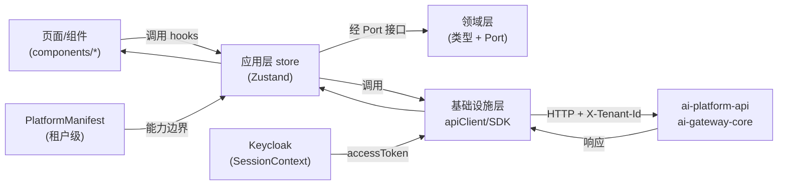
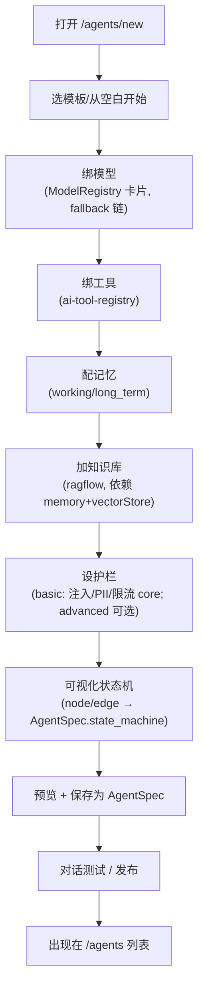
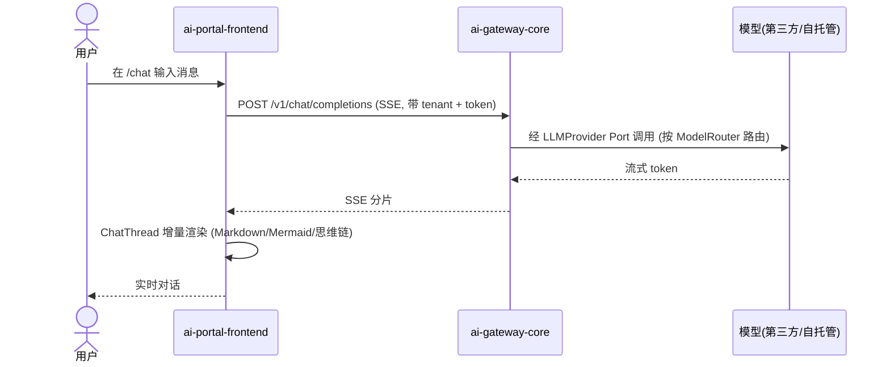

# ai-portal-frontend · 详细设计（DESIGN）

> 本文件为 `ai-portal-frontend`（开发者 / 租户门户前端）的详细设计文档，是 OpenStrata 多仓（polyrepo）体系中 frontend 域核心仓。其 `arch/` `skills/` `specs/` 为同仓演化式 AI 编码事实源；本文档与之互补，聚焦"如何落地"。

## 元信息块

| 项 | 值 |
| --- | --- |
| **repo** | `ai-portal-frontend` |
| **语言·框架** | TypeScript · React 18 + Vite + Ant Design（antd）；组件库复用 `ai-ui-kit`（见 §6） |
| **领域（domain）** | frontend（核心使用体验 / Agent 构建入口，对应 §4.1） |
| **optional** | false（core，随 starter/profile 默认安装，见 `openstrata-meta/profiles/*.yaml`） |
| **平台版本** | v1.4.0 |
| **文档状态** | 草稿（draft） |
| **负责人** | OpenStrata 架构组 |
| **关联链接** | 本仓 [arch/ARCH.md](./../arch/ARCH.md) · [skills/SKILLS.md](./../skills/SKILLS.md) · [specs/SPECS.md](./../specs/SPECS.md)；架构文档 §4.1（前端接入层）、§4.3（AgentSpec 契约）、§4.4（模型供给）、§8（多租户）、§4.8（可观测性） |

---

## 1. 产品定位与目标用户（Persona）

`ai-portal-frontend` 是 OpenStrata 面向**终端使用者与开发者**的一站式门户，承担两件事：① 让开发者"构建 Agent"（Agent 构建入口，收敛到统一的 `AgentSpec`，§4.3.5）；② 让租户成员"用好 Agent"（对话试用、知识库、工具、模型目录、用量看板）。它是 §4.1 前端接入层中 `AI UI 组件库` 的主要消费方与"业务应用"宿主。

| Persona | 角色 | 核心诉求 | 主要落地区域 |
| --- | --- | --- | --- |
| **开发者（Developer）** | 写代码 / 拼 Agent 的工程师 | 用最少步骤把"业务想法"变成可运行、可调式、可发布的 Agent | Agent 构建器（§2 路由 `/agents/*`）、模型/工具/知识库配置 |
| **租户成员 / 业务人员** | 用 Agent 提效的运营/产品/分析 | 开箱即用地对话、检索、看结果，不需要懂九层架构 | 对话试用 `/chat`、知识库浏览、用量看板 |
| **租户管理员（tenant-admin）** | 管本租户资源与边界 | 看配额/用量、管理成员、在引导门户边界内选能力 | 租户设置 `/settings`、用量/配额展示（§7） |
| **平台管理员（platform-admin）** | 跨租户治理 | 通常走 `ai-admin-frontend`（§14），本门户仅暴露其被授权的组件集 | —（经引导门户在白名单内选能力） |

> 多租户边界（谁能用哪些组件、配额多少）由 `ai-admin-frontend` + `ai-admin-service` 写入**租户级 `PlatformManifest`**（§14.5 协作闭环）；本门户在边界内提供能力，不自行设定配额。

---

## 2. 功能模块与路由结构（Feature map / routing）

遵循 §15.6.3 的 TypeScript 分层包结构（`features/ application/ domain/ infrastructure/ components/`）。路由以 `react-router` 组织，按 feature 切分代码（code splitting，见 §10）。

| 路由 | 功能模块 | 对应后端 / SPI | 关联 § |
| --- | --- | --- | --- |
| `/` | 概览 Dashboard：本租户 Agent 数、今日调用/Token、健康度 | `ai-platform-api` 聚合 | §4.8 |
| `/agents` | Agent 列表（虚拟滚动表格、`DataTable`） | `ai-platform-api`（`AgentSpec` 列表） | §4.3.5 |
| `/agents/new` `/agents/:id/edit` | **Agent 构建器**（模型/工具/记忆/知识库/护栏/状态机可视化） | `ai-platform-api` 写 `AgentSpec` | §4.3.5 · §4.4 |
| `/agents/:id` | Agent 详情：调试、对话测试、`ChatThread` | `ai-gateway-core`（OpenAI-compatible `/chat/completions`） | §4.4.1 |
| `/chat` | 通用对话 / 一键尝鲜（"我要一个能聊天的 Agent"）→ `ChatThread` | `ai-gateway-core` 流式 SSE | §13.4 · §4.4 |
| `/knowledge` | 知识库管理（文档上传/切片预览/检索测试，`react-dropzone` + `MermaidRenderer`） | `ai-tool-registry`/`ragflow` via `ai-platform-api` | §4.3 · §4.4.3 |
| `/tools` | 工具 / MCP 注册浏览（可绑到 Agent） | `ai-tool-registry` | §4.3.2 |
| `/models` | 模型目录（ModelRegistry 卡片：能力/价格/健康/白名单） | `ai-platform-api`（`ModelRegistry`） | §4.4.5 |
| `/models/keys` | 第三方模型 Key 配置（Qwen/OpenAI/Claude） | `ai-platform-api` → `ai-gateway-core` | §4.4 · §12.1 `modelProviders` |
| `/usage` | 用量 / 配额看板（Token/QPS/向量数，见 §7） | `ai-billing-service`（optional）计量 | §8 · §14.5 |
| `/settings` | 租户设置：主题/品牌、成员、API Key | `ai-platform-api`/`Keycloak` | §8 · §14.3 |

> 路由守卫：受保护的路由统一经 `AuthGuard`（§5 鉴权）拦截；`tenant-admin` 仅能访问本租户作用域数据，`platform-admin` 经 `ai-admin-frontend` 跨租户。

---

## 3. 状态管理与数据流（含与后端会话/租户态）

### 3.1 分层与状态库选型

按 §15.6.3 的 TS 分层，状态分三层管理，避免"把所有东西塞进一个全局 store"：

- **基础设施层 `infrastructure/`**：`apiClient`（§5）、SDK 适配器、`AuthProvider` 注入。
- **应用层 `application/`**：每 feature 一个 `*.store.ts`（采用 **Zustand**，轻量、可 SSR/测试），封装用例调用（如 `useAgentBuilder`、`useChatSession`）。
- **领域层 `domain/`**：纯类型/`interface`（`AgentSpec`、`ModelCard`、`TenantQuota` 等），定义 **Port（服务接口）**，不依赖具体 HTTP 实现（依赖倒置，呼应 §15.6.2）。

### 3.2 会话态 / 租户态（全局 Context）

```typescript
// application/session/SessionContext.tsx —— 全局会话/租户态（由 Keycloak 注入）
interface SessionState {
  user: { id: string; name: string; roles: Role[] };   // platform-admin | tenant-admin | developer | viewer
  tenant: { id: string; name: string; plan: 'trial'|'standard'|'enterprise'; theme: TenantTheme };
  manifest: PlatformManifest;      // 当前租户已启用组件（决定左侧菜单/可用能力，§14.5）
  accessToken: string;             // Bearer，随请求下发（§5）
}
```

- `tenant.id` 作为所有后端请求的 `X-Tenant-Id` 头（§8 租户模型，`tenant_id` 贯穿）。
- `manifest` 决定"能力卡片"是否可见（如未启用 `rag` 则 `/knowledge` 灰显），与引导门户（§13）写入的边界一致。
- 会话态过期由 `AuthProvider` 监听 401 自动用 refresh token 续期（§5）。

### 3.3 数据流示意



> 设计约束：领域层只依赖 Port，**不**直接 `fetch`；任何外部调用均经 `infrastructure/`，与 §15.6.2.1 的"编译期依赖由外向内、运行期经 Port 落 Adapter"一致。

---

## 4. 关键用户流程（UX flow）

### 4.1 Agent 构建主流程（核心入口，收敛到 AgentSpec）



> 该流程的产物即 §4.3.5 的 `AgentSpec`（声明式、与运行时无关）：`model_binding`/`tool_bindings`/`memory_bindings`/`state_machine`/`guardrails` 一一对应上图各步。三条构建路径（低代码画布 / Python LangGraph / Java Spring AI）最终都收敛到同一份 `AgentSpec`。

### 4.2 对话试用流程（流式 UX）



> 对话态（`useChatSession`）保存在应用层 store，支持重连续传；异常时走 §5 错误态与 §9 埋点。

---

## 5. 与后端 API 的集成（API client / 鉴权 / 错误态）

### 5.1 API Client（基础设施层）

```typescript
// infrastructure/apiClient.ts —— 统一基类：注入租户头 + 鉴权 + 错误归一
export class ApiClient {
  constructor(private baseUrl: string, private session: SessionContext) {}
  async request<T>(path: string, init: RequestInit): Promise<T> {
    const res = await fetch(`${this.baseUrl}${path}`, {
      ...init,
      headers: {
        'Authorization': `Bearer ${this.session.accessToken}`,
        'X-Tenant-Id': this.session.tenant.id,   // §8 tenant_id 贯穿
        'Content-Type': 'application/json',
        ...init.headers,
      },
    });
    if (!res.ok) throw await this.normalizeError(res);   // 错误态归一
    return res.json() as Promise<T>;
  }
}
```

### 5.2 鉴权（Keycloak OIDC，§4.7.3）

- 登录走 Keycloak OIDC 授权码流，拿到 `access_token` + `refresh_token`，注入 `SessionContext`（§3.2）。
- 单租户小团队场景下可跳过 SSO（§4.7.3、§8.1 视角），用本地 API Key 模式（`/models/keys`）等同于开发者本地登录。
- 所有受保护路由经 `AuthGuard`；`401` → 静默 `refresh`，失败则跳转登录并保留回跳地址。

### 5.3 与网关的流式契约

- 对话/补全走 `ai-gateway-core` 暴露的 **OpenAI-compatible** `/v1/chat/completions`（§4.4.1、§4.4.5 协议归一），SSE 流用 `fetch` + `ReadableStream` 解析，渲染交给 `ai-ui-kit` 的 `ChatThread`。

### 5.4 错误态（统一 UX）

| HTTP | 触发 | 前端处理 |
| --- | --- | --- |
| `401` | token 过期/无效 | 静默 refresh → 重试；失败跳登录 |
| `403` | 越权（如跨租户/未授权组件） | 全局 `Result` 页 + 审计提示（§14.6） |
| `404` | 资源不存在 | 空态组件（`EmptyState`） |
| `409` | 冲突（如 Agent 名重复） | 表单级内联错误 |
| `422` | 参数校验失败 | 字段级错误提示（对齐 `AgentSpec` schema） |
| `429` | 触发 `tenant × model` 限流（§4.4.5、§4.7.4） | Toast + 退避重试（指数退避） |
| `5xx` | 后端故障 | 错误边界（ErrorBoundary）+ 上报（§9）+ "重试"按钮 |

> 错误统一归一为 `AppError { code, message, tenantSafe }`，`tenantSafe=false` 的敏感信息（堆栈/内部错误）不向用户展示、仅上报。

---

## 6. 复用 ai-ui-kit 的组件（组件使用约定）

`ai-ui-kit`（§4.1.2）是本门户的**唯一 UI 组件来源**，禁止在业务仓重复造轮子。约定：

| 场景 | 复用组件 | 说明 |
| --- | --- | --- |
| 对话 / 流式渲染 | `ChatThread` | `streaming` + `components.mermaid/table/thinking/markdown`（§4.1.2 示例） |
| 思维链 | `ThinkingProcess` | 折叠式推理步骤 |
| 表格 / 列表 | `DataTable`（TanStack Table + antd） | Agent 列表/用量表，支持排序/筛选/虚拟滚动 |
| 流程图 / 架构图 | `MermaidRenderer` | Agent 状态机、依赖图、用量趋势图 |
| 工具调用展示 | `ToolCallCard` | `ChatThread.onToolCall` 回调 |
| Markdown / 代码高亮 | `MarkdownRenderer` + `shiki` | LLM 输出、文档预览 |
| 文件上传 | `FileUpload`（react-dropzone） | 知识库文档上传 |
| 富文本编辑 | `RichTextEditor`（Tiptap） | 提示词编辑 |
| 数据可视化 | `Chart`（Recharts/ECharts） | `/usage` 配额/成本图 |

**使用约定**：
1. 业务仓通过 `@openstrata/ui-kit` 引入（workspace alias / npm），版本与 `bom.yaml` 钉死。
2. 业务仓只做"组合与编排"，不在 `components/` 重写通用原子组件；确需定制走 `ai-ui-kit` 的 `Slot`/主题变量覆盖。
3. 组件 props 以 `ai-ui-kit` 的 Storybook 为契约事实源，破坏性变更由 `ai-ui-kit` 发 MAJOR 并附 ADR（§16.1）。

---

## 7. 多租户 UI（主题 / 租户切换 / 配额展示，映射 §8·§14）

本门户是 §8 多租户形态下的"终端使用面"，须让 `tenant_id` 在 UI 上可见、可感、可管（在边界内）。

### 7.1 主题与品牌（§8 / §14.2 SSO·域名）

- `TenantTheme`（`primaryColor`、`logo`、`productName`）由 `manifest.theme` 注入 antd `ConfigProvider` 的 `theme.token`，实现"一租户一皮肤"而不改代码。
- 单租户形态（§8.1 视角）下使用平台默认主题，跳过品牌注入。

### 7.2 租户切换（仅 platform-admin / 跨租户治理）

- `platform-admin` 在顶栏 `TenantSwitcher` 切换当前 `tenant.id`；切换即重取 `manifest` 与配额（§3.2）。
- `tenant-admin` / `developer` 默认锁定本租户，无切换入口（RBAC 作用域，§14.3）。

### 7.3 配额展示（§8.1 / §14.5 资源画像）

用量看板（`/usage`）以"分配 Allocated / 使用 Used / 隔离 Isolation / 账单 Billing"四维呈现（呼应 §14.5 图）：

| 维度 | 展示 | 数据来源 |
| --- | --- | --- |
| Token | 月度预算 vs 已用（进度条 + 告警阈值） | `ai-billing-service` 计量（optional） |
| QPS | 实时 QPS vs 配额 | 网关计量 |
| 向量数 | 套餐上限 vs 已用 | `Milvus`/`Qdrant` 统计（§14.5） |
| 模型访问 | 白名单（只读，变更走管理 Portal/引导门户） | `ModelRegistry` 鉴权（§14.5） |
| 成本 | Showback/Chargeback 预算 vs 实支 | 结算引擎（§8.3） |

> 配额维度与阶段对齐（§8.1·§14.4 D-level 注）：advanced/阶段三默认治理 **CPU、Token、QPS、向量数**；**GPU 配额随阶段四（自托管推理 full 档）才实际生效**——前期用第三方 API 时无 GPU 概念，UI 不展示 GPU 配额。

---

## 8. 构建与部署（Vite / CI-CD）

- **构建**：Vite（TS + React 18）。`npm run build` → 静态产物；按 route 做 `React.lazy` 代码分割（§10）。
- **容器化**：多阶段 `Dockerfile`，`nginx:alpine` 托管静态资源，通过 `env` 注入 `VITE_API_BASE` / `VITE_KEYCLOAK_URL`（配置外置，呼应 §15.6 云原生）。
- **K8s**：`helm/` 模板（ingress + configmap + deployment），挂载 ConfigMap 注入运行期配置；无状态、可水平扩容。
- **CI/CD（每仓独立，§15.7.2）**：`.github/` 流水线 = `lint → tsc 类型检查 → 单测 → build → 镜像扫描(Trivy) → 推送镜像`。依赖 `ai-ui-kit` 钉版本（来自 `bom.yaml`）。
- **与元仓装配**：引导门户（§13）/ 装配引擎按 `repos.yaml` 钉 `ai-portal-frontend@v1.4.0` 拉取镜像，按 `profiles/*` 决定本仓是否纳入该档（starter/standard/advanced/full 均含本仓）。

---

## 9. 可观测性 / 错误监控

- **前端埋点**：`@opentelemetry/web` 采集用户操作、路由切换、API 耗时、渲染异常，span 经 OTLP 上报（§4.8 core 基线：OTel traces + 审计）。
- **错误监控**：全局 `ErrorBoundary` + `window.onerror`/`unhandledrejection` → 上报 Sentry（或等价），采样携带 `tenant.id`（脱敏，不含 PII）。
- **审计**：敏感操作（保存 AgentSpec、改模型 Key、删知识库）经 `ai-platform-api` 写不可变审计日志（§4.8 / §14.6）。
- **会话级追踪**：对话链路携带 `trace-id`（网关透传），前端展示"本次对话的链路耗时"便于排障。
- **指标**：首屏 LCP、交互 INP、路由错误率，接入 Grafana（§4.8 Metrics）。

---

## 10. 性能 / 无障碍

- **性能**：路由级懒加载 + 预取；`DataTable` 虚拟滚动（TanStack Virtual）应对万级 Agent/用量行；静态资源 CDN + `brotli`；`ai-gateway-core` 流式首字延迟优先（不阻塞整页）。
- **无障碍（a11y）**：antd 组件原生 a11y；所有交互元素可键盘可达、`aria-label` 完整；对话区 `role="log"` + `aria-live="polite"`；主题对比度满足 WCAG AA；支持 `prefers-reduced-motion` 关闭动画。
- **国际化**：文案走 i18n（含中文/英文），与多租户品牌解耦（§7.1）。
- **降级**：`ai-ui-kit` 组件加载失败时回退纯文本渲染，保证核心对话可用。

---

## 11. 开放问题

1. **Agent 构建器的状态机可视化**用自研轻量节点编辑器还是直接复用 `ai-ui-kit` 的 `FlowCanvas`？需确认 `ai-ui-kit` 是否已提供（§4.1.2 未列 Flow 编辑器）。
2. **单租户无 Keycloak** 时，登录态如何与 `ai-gateway-core` 的 API Key 模式对齐？是否需要本地轻量 auth stub。
3. **用量数据实时性**：`ai-billing-service` 为 optional（仅多租户），单租户下 `/usage` 配额展示数据源回退到哪（网关计量？）。
4. **`AgentSpec` 前端 Schema 校验**是否与 `specs/` 的 OpenAPI/AgentSpec schema 同源生成（避免双份维护）。
5. `platform-admin` 跨租户切换在 `ai-portal-frontend` 与 `ai-admin-frontend` 之间如何共享 `TenantSwitcher` 组件（抽回 `ai-ui-kit`？）。

---

## 尾部

### 变更记录

| 版本 | 日期 | 作者 | 说明 |
| --- | --- | --- | --- |
| v0.1-draft | 2026-07-17 | OpenStrata 架构组 | 初稿，覆盖占位骨架，按统一 11 节撰写 |

### 追溯矩阵（本文档章节 ↔ 架构设计文档 § 编号）

| 本文档 | 架构文档 § |
| --- | --- |
| §1 产品定位 / Persona | §4.1（前端接入层）、§15.2（自研服务清单） |
| §2 功能模块 / 路由 | §4.1、§4.3.5（AgentSpec）、§4.4.5（模型目录） |
| §3 状态 / 数据流 | §15.6.2（DDD 分层）、§15.6.3（TS 包结构） |
| §4 关键 UX 流程 | §4.3.5（AgentSpec 收敛）、§4.4.1（网关）、§13.4（一键尝鲜） |
| §5 API 集成 / 鉴权 | §4.4.1（OpenAI-compatible）、§4.7.3（Keycloak）、§4.7.4（限流 429） |
| §6 复用 ai-ui-kit | §4.1.2（AI UI 组件库） |
| §7 多租户 UI | §8（多租户隔离与计费）、§14（管理 Portal）、§14.5（租户资源画像） |
| §8 构建与部署 | §15.6.1（TS 框架）、§15.7.2（每仓 CI）、§12.2（Profile） |
| §9 可观测性 | §4.8（可观测性层）、§14.6（审计） |
| §10 性能 / 无障碍 | §4.8（Metrics）、§4.7.4（风控） |
| §11 开放问题 | — |
