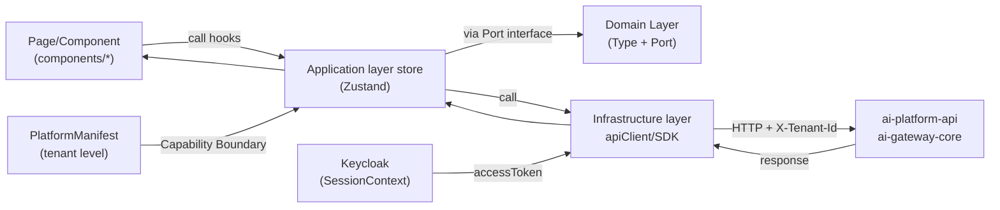
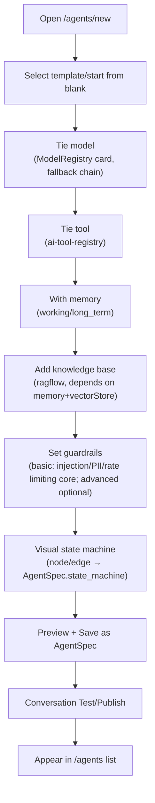
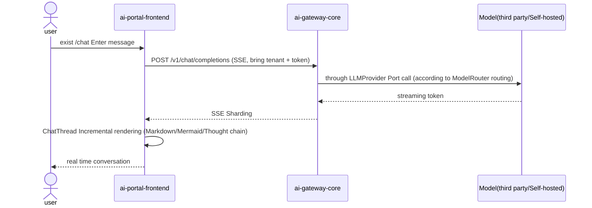

# ai-portal-frontend · DESIGN

> This document is the detailed design document of `ai-portal-frontend` (developer/tenant portal front-end), which is the core repository of the frontend domain in the OpenStrata multi-repository (polyrepo) system. Its `arch/` `skills/` `specs/` is the source of fact for evolutionary AI coding in the same repository; this document complements it and focuses on "how to implement it".

## Meta information block

| item | value |
| --- | --- |
| **repo** | `ai-portal-frontend` |
| **Language · Framework** | TypeScript · React 18 + Vite + Ant Design (antd); component library reuse `ai-ui-kit` (see §6) |
| **Domain** | frontend (core user experience/Agent construction entrance, corresponding to §4.1) |
| **optional** | false (core, installed by default with starter/profile, see `openstrata-meta/profiles/*.yaml`) |
| **Platform version** | v1.0.0 |
| **Document Status** | Draft (draft) |
| **Responsible Person** | OpenStrata Architecture Group |
| **Affiliated links** | This repository [arch/ARCH.md](./../arch/ARCH.md) · [skills/SKILLS.md](./../skills/SKILLS.md) · [specs/SPECS.md](./../specs/SPECS.md); Architecture document §4.1 (front-end access layer), §4.3 (AgentSpec Contract), §4.4 (Model Provisioning), §8 (Multi-tenancy), §4.8 (Observability) |

---

## 1. Product positioning and target users (Persona)

`ai-portal-frontend` is OpenStrata's one-stop portal for **end users and developers**. It is responsible for two things: ① Let developers "build Agent" (Agent construction entrance, converged to a unified `AgentSpec`, §4.3.5); ② Let tenant members "make good use of Agent" (dialog trial, knowledge base, tools, model directory, usage dashboard). It is the main consumer and "business application" host of the `AI UI component library` in the front-end access layer in §4.1.

| Persona | Role | Core demands | Main target areas |
| --- | --- | --- | --- |
| **Developer** | Engineers who write code/build Agents | Use the minimum steps to turn "business ideas" into runnable, debugable, and releasable Agents | Agent builder (§2 route `/agents/*`), model/tool/knowledge base configuration |
| **Tenant members/business personnel** | Operations/products/analysis that use Agent to improve efficiency | Conversation, retrieval, and viewing results out of the box, no need to understand the nine-layer architecture | Conversation trial `/chat`, knowledge base browsing, usage dashboard |
| **Tenant Administrator (tenant-admin)** | Manage tenant resources and boundaries | View quota/usage, manage members, and select capabilities within the boot portal boundary | Tenant settings `/settings`, usage/quota display (§7) |
| **Platform Administrator (platform-admin)** | Cross-tenant governance | Usually go through `ai-admin-frontend` (§14), this portal only exposes its authorized component set | — (Ability to be selected in the whitelist through the guided portal) |

> The multi-tenant boundary (who can use which components and how much quota) is written into the **tenant-level `PlatformManifest`** (§14.5 Collaboration closed loop) by `ai-admin-frontend` + `ai-admin-service` (§14.5 Collaboration closed loop); this portal provides capabilities within the boundary and does not set quotas by itself.

---

## 2. Function module and routing structure (Feature map/routing)

Follows the TypeScript hierarchical package structure (`features/application/domain/infrastructure/components/`) following §15.5.3. Routes are organized into `react-router`, and code is split by feature (code splitting, see §10).

| Routing | Function module | Corresponding backend/SPI | Association § |
| --- | --- | --- | --- |
| `/` | Overview Dashboard: Number of Agents of this tenant, today’s calls/Token, health degree | `ai-platform-api` aggregation | §4.8 |
| `/agents` | Agent list (virtual scrolling table, `DataTable`) | `ai-platform-api` (`AgentSpec` list) | §4.3.5 |
| `/agents/new` `/agents/:id/edit` | **Agent Builder** (model/tools/memory/knowledgebase/guardrails/state-machine-visualization) | `ai-platform-api` writes `AgentSpec` | §4.3.5 · §4.4 |
| `/agents/:id` | Agent details: debugging, conversation testing, `ChatThread` | `ai-gateway-core` (OpenAI-compatible `/chat/completions`) | §4.4.1 |
| `/chat` | Universal conversation / One-click tryout ("I want an Agent that can chat") → `ChatThread` | `ai-gateway-core` Streaming SSE | §13.4 · §4.4 |
| `/knowledge` | Knowledge base management (document upload/slice preview/retrieval test, `react-dropzone` + `MermaidRenderer`) | `ai-tool-registry`/`ragflow` via `ai-platform-api` | §4.3 · §4.4.3 |
| `/tools` | Tools/MCP registration browsing (can be tied to Agent) | `ai-tool-registry` | §4.3.2 |
| `/models` | Model directory (ModelRegistry cards: capabilities/price/health/whitelist) | `ai-platform-api` (`ModelRegistry`) | §4.4.5 |
| `/models/keys` | Third-party model Key configuration (Qwen/OpenAI/Claude) | `ai-platform-api` → `ai-gateway-core` | §4.4 · §12.1 `modelProviders` |
| `/usage` | Usage/Quota dashboard (Token/QPS/Vector number, see §7) | `ai-billing-service` (optional) measurement | §8 · §14.5 |
| `/settings` | Tenant settings: theme/brand, members, API Key | `ai-platform-api`/`Keycloak` | §8 · §14.3 |

> Route Guard: Protected routes are intercepted by `AuthGuard` (§5 authentication); `tenant-admin` can only access data within the scope of this tenant, and `platform-admin` passes through `ai-admin-frontend` across tenants.

---

## 3. State management and data flow (including back-end session/tenant state)

### 3.1 Layering and state library selection

According to the TS layering in §15.5.3, the status is managed in three layers to avoid "stuffing everything into a global store":

- **Infrastructure layer `infrastructure/`**: `apiClient` (§5), SDK adapter, `AuthProvider` injection.
- **Application layer `application/`**: One `*.store.ts` for each feature (using **Zusand**, lightweight, SSR/testable), encapsulating use case calls (such as `useAgentBuilder`, `useChatSession`).
- **Domain layer `domain/`**: pure type/`interface` (`AgentSpec`, `ModelCard`, `TenantQuota`, etc.), defines **Port (service interface)**, does not rely on specific HTTP implementation (dependency inversion, echoing §15.5.2).

### 3.2 Session state/tenant state (global Context)

```typescript
//application/session/SessionContext.tsx - global session/tenant state (injected by Keycloak)
interface SessionState {
  user: { id: string; name: string; roles: Role[] };   // platform-admin | tenant-admin | developer | viewer
  tenant: { id: string; name: string; plan: 'trial'|'standard'|'enterprise'; theme: TenantTheme };
  manifest: PlatformManifest;      //Components are enabled for the current tenant (determines left menu/available capabilities, §14.5)
  accessToken: string;             //Bearer, issued upon request (§5)
}
```

- `tenant.id` as the `X-Tenant-Id` header for all backend requests (§8 Tenant Model, `tenant_id` runs through).
- `manifest` determines whether the "ability card" is visible (if `rag` is not enabled, `/knowledge` is grayed out), consistent with the boundaries written by the boot portal (§13).
- Session state expiration is monitored by `AuthProvider` and 401 is automatically renewed with refresh token (§5).

### 3.3 Data flow diagram



> Design constraints: The domain layer only relies on Port, not `fetch` directly; any external calls go through `infrastructure/`, which is consistent with §15.5.2.1 "Compilation-time dependencies go from outside to in, and runtime goes through Port and falls into Adapter".

---

## 4. Key user flow (UX flow)

### 4.1 Agent construction main process (core entry, converged to AgentSpec)



> The product of this process is the `AgentSpec` of §4.3.5 (declarative, runtime-independent): `model_binding`/`tool_bindings`/`memory_bindings`/`state_machine`/`guardrails` corresponds one-to-one to each step in the above figure. The three build paths (Low Code Canvas / Python LangGraph / Java Spring AI) eventually converge to the same `AgentSpec`.

### 4.2 Dialogue trial process (streaming UX)



> The conversation state (`useChatSession`) is saved in the application layer store and supports re-transmission; in case of exception, go to §5 error state and §9 telemetry.

---

## 5. Integration with back-end API (API client / authentication / error status)

### 5.1 API Client (Infrastructure Layer)

```typescript
//infrastructure/apiClient.ts - unified base class: inject tenant header + authentication + error normalization
export class ApiClient {
  constructor(private baseUrl: string, private session: SessionContext) {}
  async request<T>(path: string, init: RequestInit): Promise<T> {
    const res = await fetch(`${this.baseUrl}${path}`, {
      ...init,
      headers: {
        'Authorization': `Bearer ${this.session.accessToken}`,
        'X-Tenant-Id': this.session.tenant.id,   //§8 tenant_id runs through
        'Content-Type': 'application/json',
        ...init.headers,
      },
    });
    if (!res.ok) throw await this.normalizeError(res);   //error state normalization
    return res.json() as Promise<T>;
  }
}
```

### 5.2 Authentication (Keycloak OIDC, §4.7.3)

- Log in and go through the Keycloak OIDC authorization code flow, get `access_token` + `refresh_token`, and inject `SessionContext` (§3.2).
- In the single-tenant small team scenario, SSO can be skipped (§4.7.3, §8.1 perspective), and the local API Key mode (`/models/keys`) is used, which is equivalent to the developer's local login.
- All protected routes go through `AuthGuard`; `401` → silently `refresh`, if failed, jump to login and retain the bounce address.

### 5.3 Streaming contract with gateway

- Dialogue/completion goes through **OpenAI-compatible** `/v1/chat/completions` exposed by `ai-gateway-core` (§4.4.1, §4.4.5 protocol normalization), SSE stream is parsed with `fetch` + `ReadableStream`, and rendering is handed over to `ChatThread` of `ai-ui-kit`.

### 5.4 Error state (unified UX)

| HTTP | Trigger | Front-end processing |
| --- | --- | --- |
| `401` | token expired/invalid | silent refresh → retry; fail to log in |
| `403` | Override of privileges (e.g. cross-tenant/unauthorized component) | Global `Result` page + audit prompt (§14.6) |
| `404` | Resource does not exist | Empty state component (`EmptyState`) |
| `409` | Conflict (e.g. duplicate Agent name) | Form-level inline error |
| `422` | Parameter verification failed | Field-level error prompt (aligned with `AgentSpec` schema) |
| `429` | Trigger `tenant × model` rate limiting (§4.4.5, §4.7.4) | Toast + backoff retry (exponential backoff) |
| `5xx` | Backend failure | Error boundary (ErrorBoundary) + reporting (§9) + "Retry" button |

> Errors are unified into `AppError { code, message, tenantSafe }`, and sensitive information (stack/internal errors) with `tenantSafe=false` will not be displayed to the user, only reported.

---

## 6. Reuse components of ai-ui-kit (component usage convention)

`ai-ui-kit` (§4.1.2) is the **only source of UI components** for this portal, and reinventing the wheel in the business repository is prohibited. Agreement:

| Scenario | Reuse components | Description |
| --- | --- | --- |
| Dialog / Streaming rendering | `ChatThread` | `streaming` + `components.mermaid/table/thinking/markdown` (§4.1.2 example) |
| Thinking chain | `ThinkingProcess` | Folding reasoning steps |
| Table/List | `DataTable` (TanStack Table + antd) | Agent list/usage table, supports sorting/filtering/virtual scrolling |
| Flow chart / architecture diagram | `MermaidRenderer` | Agent state machine, dependency graph, usage trend graph |
| Tool call display | `ToolCallCard` | `ChatThread.onToolCall` callback |
| Markdown / code highlighting | `MarkdownRenderer` + `shiki` | LLM output, document preview |
| File upload | `FileUpload` (react-dropzone) | Knowledge base document upload |
| Rich text editing | `RichTextEditor` (Tiptap) | Tip word editing |
| Data Visualization | `Chart` (Recharts/ECharts) | `/usage` Quota/Cost Chart |

**Usage Convention**:
1. The business repository is introduced through `@openstrata/ui-kit` (workspace alias / npm), and the version is nailed to `bom.yaml`.
2. The business repository only does "combination and arrangement" and does not rewrite general atomic components in `components/`; it is necessary to customize the `Slot`/theme variable coverage of `ai-ui-kit`.
3. Component props use `ai-ui-kit`’s Storybook as the source of contract fact, and destructive changes are issued by `ai-ui-kit` MAJOR and accompanied by ADR (§16.1).

---

## 7. Multi-tenant UI (theme/tenant switching/quota display, mapping §8·§14)

This portal is the "end usage surface" under the §8 multi-tenant form, and the `tenant_id` must be visible, sensible, and manageable (within the boundary) on the UI.

### 7.1 Theme and Brand (§8 / §14.2 SSO·Domain Name)

- `TenantTheme` (`primaryColor`, `logo`, `productName`) is injected from `manifest.theme` into `theme.token` of antd `ConfigProvider` to achieve "one tenant, one skin" without changing the code.
- Use the platform's default theme in single-tenant form (§8.1 Perspective) and skip brand injection.

### 7.2 Tenant switching (only platform-admin / cross-tenant governance)

- `platform-admin` switches the current `tenant.id` in the top bar `TenantSwitcher`; switching means retrieving the `manifest` and quota (§3.2).
- `tenant-admin` / `developer` locks this tenant by default, without switching entry (RBAC scope, §14.3).

### 7.3 Quota display (§8.1 / §14.5 Resource portrait)

The usage dashboard (`/usage`) is presented in four dimensions: "Allocated / Used / Isolation / Billing" (echoing the §14.5 picture):

| Dimensions | Display | Data sources |
| --- | --- | --- |
| Token | Monthly budget vs used (progress bar + alarm threshold) | `ai-billing-service` metering (optional) |
| QPS | Real-time QPS vs Quota | Gateway Metering |
| Number of vectors | Package cap vs used | `Milvus`/`Qdrant` statistics (§14.5) |
| Model access | Whitelist (read-only, change management portal/guide portal) | `ModelRegistry` authentication (§14.5) |
| Cost | Showback/Chargeback Budget vs Actual Expenditure | Settlement Engine (§8.3) |

> Alignment of quota dimensions and stages (§8.1·§14.4 D-level Note): advanced/stage three default governance **CPU, Token, QPS, number of vectors**; **GPU quota will only actually take effect with stage four (self-hosted inference full file)** - There is no concept of GPU when using third-party APIs in the early stage, and the UI does not display GPU quotas.

---

## 8. Build and deploy (Vite/CI-CD)

- **Build**: Vite (TS + React 18). `npm run build` → static product; do `React.lazy` code splitting by route (§10).
- **Containerization**: multi-stage `Dockerfile`, `nginx:alpine` hosting static resources, injecting `VITE_API_BASE` / `VITE_KEYCLOAK_URL` through `env` (configuration external, echoing §15.5 cloud native).
- **K8s**: `helm/` template (ingress + configmap + deployment), mounts ConfigMap to inject runtime configuration; stateless, horizontal expansion possible.
- **CI/CD (each repository is independent, §15.6.2)**: `.github/` Pipeline = `lint → tsc type check → single test → build → image scan (Trivy) → push image`. Depends on `ai-ui-kit` pin version (from `bom.yaml`).
- **Assembly with meta repository**: Boot portal (§13)/Assembly engine press `repos.yaml` to pin `ai-portal-frontend@v1.0.0` to pull the image, and press `profiles/*` to decide whether this repository is included in this file (starter/standard/advanced/full all include this repository).

---

## 9. Observability / Error Monitoring

- **Front-end instrumentation**: `@opentelemetry/web` collects user operations, route switching, API time consumption, rendering exceptions, and span is reported through OTLP (§4.8 core baseline: OTel traces + audit).
- **Error Monitoring**: Global `ErrorBoundary` + `window.onerror`/`unhandledrejection` → Report to Sentry (or equivalent), and the sample carries `tenant.id` (desensitized, without PII).
- **Audit**: Sensitive operations (saving AgentSpec, changing model Key, deleting knowledge base) write immutable audit logs through `ai-platform-api` (§4.8 / §14.6).
- **Session-level tracing**: The conversation link carries `trace-id` (gateway pass-through), and the front-end displays "the link time of this conversation" to facilitate troubleshooting.
- **Metrics**: First screen LCP, interactive INP, routing error rate, access to Grafana (§4.8 Metrics).

---

## 10. Performance/Accessibility

- **Performance**: Route-level lazy loading + prefetching; `DataTable` virtual scrolling (TanStack Virtual) can handle tens of thousands of Agents/usage rows; static resource CDN + `brotli`; `ai-gateway-core` streaming first word delay priority (not blocking the entire page).
- **Accessibility (a11y)**: antd component is native a11y; all interactive elements are keyboard reachable, `aria-label` is complete; dialog area `role="log"` + `aria-live="polite"`; theme contrast meets WCAG AA; supports `prefers-reduced-motion` to turn off animation.
- **Internationalization**: The copywriting adopts i18n (including Chinese/English) and is decoupled from the multi-tenant brand (§7.1).
- **Downgrade**: `ai-ui-kit` falls back to plain text rendering when the component fails to load to ensure that the core dialogue is available.

---

## 11. Open questions

1. For state machine visualization of the Agent builder, should I use the self-developed lightweight node editor or directly reuse the `FlowCanvas` of `ai-ui-kit`? Need to confirm whether `ai-ui-kit` has been provided (§4.1.2 Flow editor is not listed).
2. When **single tenant does not have Keycloak**, how to align the login state with the API Key mode of `ai-gateway-core`? Do you need a local lightweight auth stub.
3. **Real-time performance of usage data**: `ai-billing-service` is optional (multi-tenant only). Under a single tenant, the `/usage` quota shows where the data source falls back (gateway metering?).
4. Whether the **`AgentSpec` front-end Schema verification** is generated from the same source as the OpenAPI/AgentSpec schema of `specs/` (to avoid double maintenance).
5. How does `platform-admin` cross-tenant switching share the `TenantSwitcher` component between `ai-portal-frontend` and `ai-admin-frontend` (withdraw `ai-ui-kit`?).

---

## Tail

### Change Record

| Version | Date | Author | Description |
| --- | --- | --- | --- |
| v0.1-draft | 2026-07-17 | OpenStrata Architecture Group | First draft, covering the placeholder skeleton, written according to Unification Section 11 |

### Traceability Matrix (Chapter of this document ↔ Architecture Design Document § Number)

| This document | Architecture documentation § |
| --- | --- |
| §1 Product Positioning / Persona | §4.1 (front-end access layer), §15.2 (self-developed service list) |
| §2 Function Module/Routing | §4.1, §4.3.5 (AgentSpec), §4.4.5 (Model Directory) |
| §3 Status/Data Flow | §15.5.2 (DDD layering), §15.5.3 (TS package structure) |
| §4 Key UX Processes | §4.3.5 (AgentSpec Convergence), §4.4.1 (Gateway), §13.4 (One-click Adoption) |
| §5 API integration/authentication | §4.4.1 (OpenAI-compatible), §4.7.3 (Keycloak), §4.7.4 (current limit 429) |
| §6 Reuse ai-ui-kit | §4.1.2 (AI UI component library) |
| §7 Multi-tenant UI | §8 (Multi-tenant isolation and accounting), §14 (Management Portal), §14.5 (Tenant resource portrait) |
| §8 Build and Deployment | §15.5.1 (TS Framework), §15.6.2 (CI per repository), §12.2 (Profile) |
| §9 Observability | §4.8 (observability layer), §14.6 (auditing) |
| §10 Performance/Accessibility | §4.8 (Metrics), §4.7.4 (Risk Control) |
| §11 Open Question | — |
